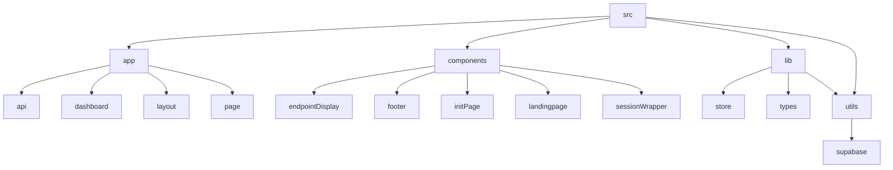

# Lazy Ping - Automated API Endpoint Pinger

## 🗂️ Description

Lazy Ping is an open-source application designed to automate the process of pinging API endpoints at regular intervals. The application allows users to create projects, add endpoints, and monitor their status. It leverages Supabase for database operations and NextAuth for authentication. This project is ideal for developers and teams who need to ensure their APIs are always responsive.

The application provides a user-friendly interface for managing projects and endpoints, making it easy to set up and monitor API pings. With its automated pinging feature, users can focus on other tasks while Lazy Ping ensures their APIs are up and running.

## ✨ Key Features

### **Core Features**
- **Project Management**: Create and manage projects with ease.
- **Endpoint Management**: Add, edit, and delete API endpoints for each project.
- **Automated Pinging**: Schedule pings to API endpoints at regular intervals.
- **Status Monitoring**: Monitor the status of your API endpoints.

### **Authentication and Authorization**
- **NextAuth Integration**: Secure authentication and authorization for users.

### **Database Operations**
- **Supabase Integration**: Utilizes Supabase for efficient database operations.

## 🗂️ Folder Structure



## 🛠️ Tech Stack


## ⚙️ Setup Instructions

### Prerequisites
- Node.js (v16 or higher)
- npm or yarn

### Installation
1. Clone the repository:
   ```bash
git clone https://github.com/abhraneeldhar7/lazy-ping.git
```
2. Navigate to the project directory:
   ```bash
cd lazy-ping
```
3. Install dependencies:
   ```bash
npm install
```
   or
   ```bash
yarn install
```
4. Start the application:
   ```bash
npm run dev
```
   or
   ```bash
yarn dev
```

## 📈 GitHub Actions

The project utilizes a GitHub Actions workflow to schedule pings to the application's API endpoint every 10 minutes. This ensures that the application remains active and functional.

```yml
name: Ping API

on:
  schedule:
    - cron:  */10 * * * *

jobs:
  ping:
    runs-on: ubuntu-latest
    steps:
      - name: Checkout code
        uses: actions/checkout@v2

      - name: Ping API
        run: |
          curl -X GET \
          https://lazy-ping.vercel.app/api/ping \
          -H 'Content-Type: application/json'
```

## 🤝 Further Assistance

For any questions or further assistance, feel free to reach out to the project maintainer or open an issue on the GitHub repository.


<br><br>
<div align="center">

<h3>Abhra the Neel</h3>
<p>Full-stack developer with expertise in web, Android, and server-side development. Most projects are private due to being production code.</p>
</div>
<br>
<p align="right">
  <a href="https://gitfull.vercel.app">Made by GitFull</a>
</p>
    