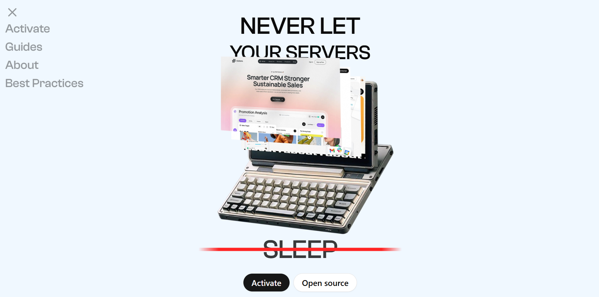

# Lazy Ping - Automated Endpoint Pinger

## 🗂️ Description

Lazy Ping is a Next.js project that automates the process of pinging endpoints at regular intervals. It's designed for developers and DevOps teams who want to monitor their endpoints' uptime and performance. The project uses Supabase for database management and NextAuth for authentication.

The application allows users to create projects, add endpoints, and configure ping intervals. It also provides features like authentication, authorization, and logging. The project aims to provide a simple and efficient way to monitor endpoint performance and receive notifications when issues arise.

## ✨ Key Features

### **Core Features**

* **Endpoint Management**: Create, edit, and delete endpoints for projects
* **Project Management**: Create, edit, and delete projects
* **Ping Automation**: Automatically ping endpoints at configured intervals
* **Authentication**: Secure authentication using NextAuth
* **Authorization**: Role-based access control for project and endpoint management

### **UI Features**

* **Dashboard**: View project and endpoint information
* **Endpoint Display**: Display endpoint information, including ping history and logs
* **How-to-use Section**: Guide users on how to use the application
* **Pricing Plans Section**: Display pricing plans and features

## 🗂️ Folder Structure


## 🛠️ Tech Stack


## ⚙️ Setup Instructions

### Prerequisites

* Node.js (v16 or higher)
* npm or yarn
* Supabase account

### Installation

1. Git clone the repository: `git clone https://github.com/abhraneeldhar7/lazy-ping.git`
2. Install dependencies: `npm install` or `yarn install`
3. Create a Supabase account and create a new project
4. Create a `.env` file and add your Supabase credentials
5. Run the application: `npm run dev` or `yarn dev`

## 📈 GitHub Actions

The project uses a GitHub Actions workflow to ping an endpoint every 10 minutes. The workflow is defined in `.github/workflows/ping.yml`.

```yml
name: Ping Endpoint

on:
  schedule:
    - cron:  */10 * * * *

jobs:
  ping:
    runs-on: ubuntu-latest
    steps:
      - name: Checkout code
        uses: actions/checkout@v2

      - name: Run ping script
        run: |
          curl -X POST \
          https://<your-endpoint-url>/api/ping \
          -H 'Content-Type: application/json' \
          -d '{}'
```

## 📝 Logging

The project uses logging to track ping events and errors. Logs are stored in the Supabase database.

## 🔒 Security

The project uses NextAuth for authentication and authorization. It also uses HTTPS to encrypt data in transit.


<br><br>
<div align="center">

<h3>Abhra the Neel</h3>
<p>Full-stack developer with expertise in web, Android, and server-side development. Most projects are private due to being production code.</p>
</div>
<br>
<p align="right">
  <a href="https://gitfull.vercel.app">Made by GitFull</a>
</p>
    